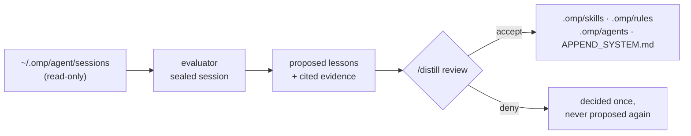

# OMP Distill Extension

Turns the sessions omp already records into reviewed project knowledge: lessons you approve, written
into the project's own skills, rules and subagent prompts.



It captures nothing and never writes to the session store. One session is one evaluation: the parent
trace and its subagents judged together.

## Install

```bash
omp plugin marketplace add Giardi77/omp-plugins
omp plugin install omp-distill-extension@giardi-plugins
```

Restart OMP afterwards. For a local checkout: `omp plugin link /path/to/omp-plugins/plugins/distill`,
then restart.

## Activate a project

Distill loads in every session and does nothing anywhere until a project opts in:

```text
/distill setup
```

That writes `.omp/distill/config.yaml`, a default `.omp/distill/evaluator.md`, `.omp/distill/lessons/`
and an ignore rule for `tmp/`.

## Commands

| Command | Effect |
| --- | --- |
| `/distill setup [--model <spec>] [--thinking <level>]` | Write this project's config and default evaluator prompt. |
| `/distill enable` · `/distill disable` | Pause or resume without uninstalling. |
| `/distill status` | Loop on or off, eligible sessions, what awaits review, how a running scan is doing. |
| `/distill scan [--limit <n>] [--session <id\|file>] [--dry-run]` | Evaluate sessions one at a time, in the background; the terminal offers the eligible ones. |
| `/distill cancel` | Stop a running scan — gracefully first, by force only if it will not go. |
| `/distill review` | Decide the proposed lessons. |
| `/distill purge [--yes]` | Forget this project's records — never omp's session files. |

## What review looks like

`/distill review` opens a window over the proposed lessons: a recap of the batch, the list, and the
selected lesson — its target, the diff of the file it writes, why it is worth keeping, and the
records it cites. At 80 columns, one lesson whose approval patches a skill and mints a reference
beside it:

```text
╭─ Distill review ─────────────────────────────────────────────────────────────╮
│ 1 lesson(s) — 1 skill                                                        │
│ touches 2 file(s): .omp/skills/bun-testing/SKILL.md,                         │
│ .omp/skills/bun-testing/references/leaks-between-files.md (new)              │
│ ❯ Bun mocks leak between test files                                          │
│                                                                              │
│ Bun mocks leak between test files                                            │
│ skill · target: bun-testing                                                  │
│                                                                              │
│ append  .omp/skills/bun-testing/SKILL.md  (+1, 3 context)                    │
│ 10   ## Running                                                              │
│ 11                                                                           │
│ 12   Run the whole suite before you report a change.                         │
│ 13 + Call `mock.restore()` in `afterAll` in any file that calls              │
│      `mock.module`.                                                          │
│                                                                              │
│ new file  .omp/skills/bun-testing/references/leaks-between-files.md  (+3)    │
│ 1 + ## What leaks and what does not                                          │
│ 2 +                                                                          │
│ 3 + `mock.module` is process-wide…                                           │
│                                                                              │
│ c shows every change in this batch                                           │
│                                                                              │
│ Why keep it:                                                                 │
│ Three separate sessions lost time to this: two chased the failure into the   │
│ wrong module, and one found it only after running the suite file by file.    │
│                                                                              │
│ evidence: 0f3a…-parent#record-118, 0f3a…-parent#record-204                   │
│ e shows what it says in the session (2 record(s))                            │
│ ↑/↓ or j/k move · a accept · d deny · e evidence · c all changes · q quit    │
╰──────────────────────────────────────────────────────────────────────────────╯
```

`↑`/`↓` or `j`/`k` move, `a` accepts, `d` denies, `e` shows the cited records as the session wrote
them, `c` shows every change in the batch at once, `q` quits. Accepting writes at once; there is no
headless approve or deny path. `PgUp`/`PgDn` scroll the pane when a lesson is longer than the room
left for it. The window borrows the alternate screen while it is open and leaves mouse reporting off,
so click-and-drag still selects text.

A change takes one of three shapes — a new file, an append against the file's own tail, or a trim of
lines it already has (`create`, `append` and `splice` in the code). Only an approval writes, and
only into the project's own surfaces:

```text
.omp/skills/<slug>/SKILL.md   patched, or minted when the slug is new — plus its references/
.omp/rules/<name>.md          with its trigger in the frontmatter
.omp/agents/<name>.md
.omp/APPEND_SYSTEM.md
```

`RULES.md` and the session store are out of scope by design. A lesson may take lines *out*
(`removes`): that is how a skill or prompt that has grown past what it earns gets trimmed rather than
added to.

## What the evaluator gets

An **inventory** of the session's traces — id, record range, size, transcript file — and no records.
It reads the records itself with `get_trace`: a section at a time, by range, or by pattern; a `jq`
query works when `jq` is on `PATH`, and is refused with a range-or-pattern suggestion when it is not.
Sections render prompts, assistant text and tool calls in full (capped per record); tool results as
their first line plus size. Cited evidence is re-extracted verbatim from the full record.

`tasks_completed` is refused until every trace has been read to its last record (ADR-0017): a run
that goes quiet is an unfinished one. Nothing is ever truncated — a payload the model refuses fails
loudly with what the provider said, leaves its traces eligible for a retry, and dumps the reason
under `tmp/`.

## A scan is a background process

`/distill scan` resolves which sessions are eligible, writes that list as a journal
(`tmp/scan.json`), and spawns a detached `omp -p --no-session "/distill _job"` that outlives the OMP
that started it. Each session in it is one model call, which `--limit` bounds. The host has a broker
that would do the spawning, but its client subpath does not resolve from a marketplace-installed
plugin, so the plugin owns the spawn (ADR-0014, ADR-0011) — which means a scan is not in `omp ps`,
and `/distill status` is where its state is read.

Division of truth: the **scan lock** — an OS lease released when its holder dies — says whether a
scan is running, and the **journal** says what it has done. A scan that dies unfinished reads as
*interrupted*, with everything it never covered still eligible, so the next scan continues. When the
spawn fails (no `omp` on `PATH`), the same runner runs in the operator's session instead, and
`status` says so. Two scans cannot run at once in one project.

`/distill cancel` writes the request the runner already polls: it aborts the evaluation in flight
and keeps everything it has recorded. A runner that will not go is killed after a ten-second grace.

## What lives where

The default `evaluator.md` ships as [`templates/evaluator.md`](templates/evaluator.md); setup copies
it once and never overwrites it.

```text
.omp/distill/
  config.yaml        # activation predicate + settings: enabled, model, thinking,
                     # include_thinking, timeout_seconds, scan_limit
  evaluator.md       # the project's own prompt — what makes a session worth learning from
  lessons/<id>.json  # proposed and approved lessons with the verbatim excerpts they cite
  decisions.jsonl    # append-only evaluation and decision ledger
  tmp/               # gitignored: scan journal, logs, failure dumps
  .locks/            # gitignored: advisory lock anchors
```

## What leaves the machine

An evaluation sends the session's traces — the parent session and its subagents — to your model
provider, plus whatever the evaluator reads from the project with its `read`, `glob` and `grep`
tools. Unmasked, by design: there is no redaction key, and `/distill scan --dry-run` prints the exact
payload before anything is sent.

The evaluator is a sealed session inside omp's own process: an explicit tool list, extension
discovery, MCP, LSP and IRC off, the tool surface asserted before any payload is sent, and an
in-memory session so a scan leaves no record in the store it reads. That surface needs omp's SDK at
17.4.0 or newer; older hosts are refused rather than run unsealed.

## Development

```bash
bun install && bun run check && bun test
```

The live-host check, the invariants and the file-by-file layout are in [AGENTS.md](AGENTS.md).
