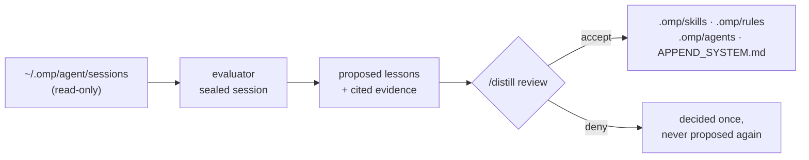

# OMP Distill Extension

Turns the sessions omp already records into reviewed project knowledge: lessons you approve, written
into the project's own skills, rules and subagent prompts.



It captures nothing and never writes to the session store. One session is one evaluation: the parent
trace and its subagents judged together.

## Install

```bash
omp plugin marketplace add Giardi77/omp-plugins
omp plugin install omp-distill-extension@giardi-plugins
```

Restart OMP afterwards. For a local checkout: `omp plugin link /path/to/omp-plugins/plugins/distill`,
then restart.

## Activate a project

Distill loads in every session and does nothing anywhere until a project opts in:

```text
/distill setup
```

That writes `.omp/distill/config.yaml`, a default `.omp/distill/evaluator.md`, `.omp/distill/lessons/`
and an ignore rule for `tmp/`.

## Commands

| Command | Effect |
| --- | --- |
| `/distill setup [--model <spec>] [--thinking <level>]` | Write this project's config and default evaluator prompt. |
| `/distill enable` · `/distill disable` | Pause or resume without uninstalling. |
| `/distill status` | Loop on or off, eligible sessions, what awaits review, how a running scan is doing. |
| `/distill scan [--limit <n>] [--session <id\|file>] [--dry-run]` | Evaluate sessions one at a time, in the background; the terminal offers the eligible ones. |
| `/distill cancel` | Stop a running scan — gracefully first, by force only if it will not go. |
| `/distill review` | Decide the proposed lessons. |
| `/distill purge [--yes]` | Forget this project's records — never omp's session files. |

In the review window:

```text
↑/↓ or j/k  move    a  accept    d  deny    e  evidence    c  all changes    q  quit
```

`PgUp`/`PgDn` scroll the detail pane when a lesson is longer than the room left for it.

## A scan is a background job

The host's daemon broker starts it detached: closing OMP does not end it, and `omp ps` lists it with
everything else the host supervises. `/distill status` reads its journal — which session it is on,
how many lessons it has proposed, or how it ended. A scan whose process died reads as *interrupted*,
its unreached sessions still eligible. Without a daemon (no `omp` on `PATH`, or a host that serves no
broker) the scan runs in the session that asked for it, and `status` says so. Two scans cannot run at
once in one project.

## What the evaluator gets

An **inventory** of the session's traces — id, record range, size, transcript file — and no records.
It reads the records itself with `get_trace`: a section at a time, by range, by pattern, or with a
`jq` query. Sections render prompts, assistant text and tool calls in full (capped per record); tool
results as their first line plus size. Cited evidence is re-extracted verbatim from the full record.

`tasks_completed` is refused until every trace has been read to its last record (ADR-0017): a run
that goes quiet is an unfinished one. Nothing is ever truncated — a payload the model refuses fails
loudly with what the provider said, leaves its traces eligible for a retry, and dumps the reason
under `tmp/`.

## What approving writes

Only an approval writes, and only into the project's own surfaces:

```text
.omp/skills/<slug>/SKILL.md   patched, or minted when the slug is new — plus its references/
.omp/rules/<name>.md          with its trigger in the frontmatter
.omp/agents/<name>.md
.omp/APPEND_SYSTEM.md
```

`RULES.md` and the session store are out of scope by design. Existing files are edited before
anything is added, and a lesson may take lines *out* (`removes`) — that is how a skill or prompt that
has grown past what it earns gets trimmed rather than added to.

The window opens with a recap of the batch — how many lessons, which files, what cannot be written —
then shows the selected lesson as a diff of the file it writes, why it is worth keeping, and the
cited records behind `e`; `c` shows every change in the batch at once. The frame is a screenful,
landing on the terminal's edges so nothing is clipped. It borrows the alternate screen while it is
open, and leaves mouse reporting off, so click-and-drag still selects text.

A change reads like this — an append with the file's own tail as context. A trim marks the lines
going out, and a new file has no context rows.

```text
append  .omp/agents/verifier.md  (+2, 3 context)
 18   
 19   ## When you are done
 20   Run the suite before you report.
 21 + A test that passes only on a re-run is a flaky test, not a passing one: report it
 22 + with the run that failed instead of re-running until it is green.
```

There is no headless approve or deny path — review is terminal-only, and accepting writes at once.

## What lives where

The default `evaluator.md` ships as [`templates/evaluator.md`](templates/evaluator.md); setup copies
it once and never overwrites it.

```text
.omp/distill/
  config.yaml        # activation predicate + settings: enabled, model, thinking,
                     # include_thinking, timeout_seconds, scan_limit
  evaluator.md       # the project's own prompt — what makes a session worth learning from
  lessons/<id>.json  # proposed and approved lessons with the verbatim excerpts they cite
  decisions.jsonl    # append-only evaluation and decision ledger
  tmp/               # gitignored: failure dumps
  .locks/            # gitignored: advisory lock anchors
```

Mechanics live in the tool descriptions, not in `evaluator.md`: editing your copy shapes the writing,
never what the plugin accepts.

## What leaves the machine

An evaluation sends the session's traces — the parent session and its subagents — to your model
provider, plus whatever the evaluator reads from the project with its `read`, `glob` and `grep`
tools. Unmasked, by design: there is no redaction key, and `/distill scan --dry-run` prints the exact
payload before anything is sent.

The evaluator runs inside omp's own process as a sealed agent session: an explicit tool list,
extension discovery, MCP, LSP and IRC off, an in-memory session so a scan leaves no record in the
store it reads, settings read from your own agent dir rather than the project's (a project can attach
an advisor and gate tools through `.omp/settings.json`), and an assertion on the mounted tool surface
before any payload is sent. That surface needs omp's SDK at 17.4.0 or newer; older hosts are refused
rather than run unsealed.

## Verify

```bash
cd plugins/distill && bun install && bun run check && bun test
```

The real model call is not covered by tests: `--dry-run` prints the payload without calling one, and
a live scan costs a model call per session.

Unit tests cannot see whether a real host loads the extension at all, so check that once per host
upgrade: `omp -p --no-session "/distill"` in a scratch project must print the usage text, not a model
answer. A load failure is logged with its path and reason in `~/.omp/logs/omp.<date>.<pid>.log`
(ADR-0011).
